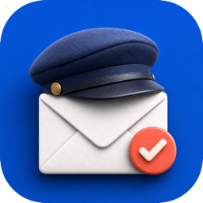

  
   
  
   
  
  

# Things Mailman

**Send selected Apple Mail messages to Things, then file the originals your way.**

Things Mailman is a native menu-bar app for macOS.

Select messages in Apple Mail, use the menu bar or press `⌥ ⌘ Return`, and Things Mailman forwards each one to your private Things address.

After forwarding, the original can stay where it is, be archived, moved to Trash, or filed in a mailbox you choose.  

# Screenshots

| Things settings | Mail settings | Automation settings |
| :---: | :---: | :---: |
| 📷 Screenshot placeholder | 📷 Screenshot placeholder | 📷 Screenshot placeholder |

> ▶️ **Demo video coming soon**  
> Video placeholder  

## Features

- Send one or many selected Mail messages to Things.
- Choose a different filing action for each Mail account.
- Launch automatically at login and customize the keyboard shortcut.
- Move the mails only after Mail confirms the forward was sent.
- Warning on bulk message send

## Set up

1. In Things, open **Settings → Things Cloud → Mail to Things → Manage** and enable Mail to Things.
2. Paste your private `@things.email` address into Things Mailman.
3. Open Apple Mail and grant Things Mailman permission when macOS asks.
4. Choose what should happen to mails for each Mail account.
5. Optionally customize the shortcut and enable launch at login.
6. Then select messages in Mail and choose **Send Selection to Things** from the menu bar.
_The shortcut works while Mail is the frontmost app._

## Privacy
Things Mailman has no server, analytics, tracking, or third-party SDKs.  

Your address and preferences stay in the app's sandbox on your Mac.  
Apple Mail sends selected messages through your email provider directly to Things.

History is kept in memory and disappears when the app quits.  
See the full [privacy policy](docs/privacy.html).  

_Please report security or privacy issues privately to [maxime.dechalendar@me.com](mailto:maxime.dechalendar@me.com).  
Things Mailman is an independent project and is not affiliated with or endorsed by Cultured Code._

## Contributing

This has been fully vibecoded, enter at your own risk 🙃.  
Good thing is you can fully vibecode on top of it, I won’t mind.  

Bug reports and pull requests are welcome.  
Just keep things simple and useful, I don’t want this to become a huge mess.  

Things Mailman is available under the [MIT License](LICENSE).
